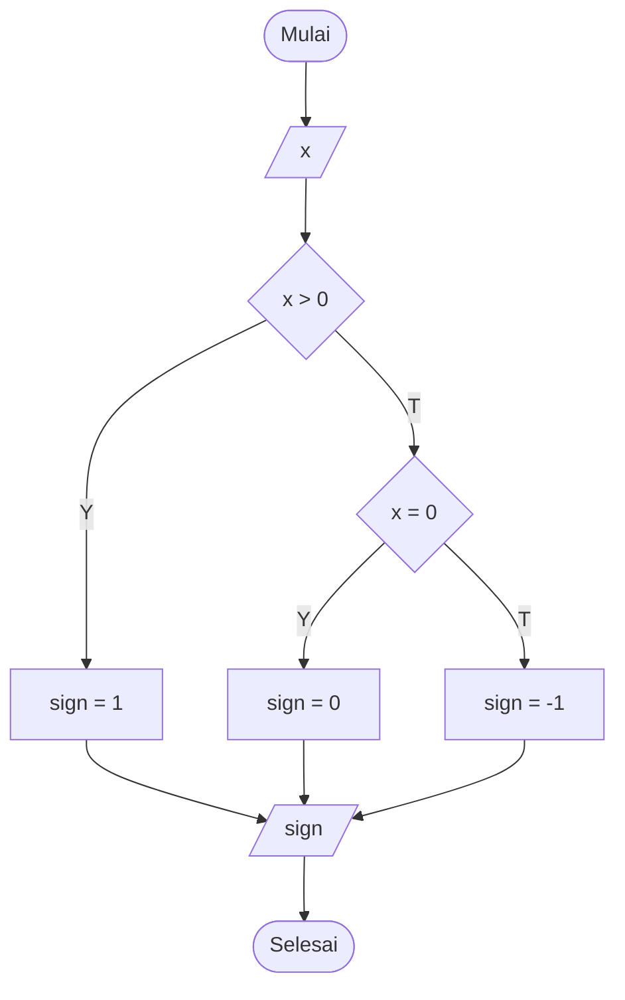

# draw_flowchart_sign
Diagram alir untuk menentukan tanda dari suatu bilangan.

Untuk menjalankannya secara lokal dengan Jupyter Notebook dapat menggunakan berkas [draw_flowchart.ipynb](draw_flowchart.ipynb).
