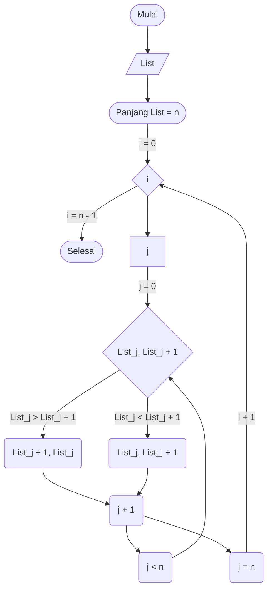

```mermaid
flowchart TD
    A([ Mulai ]);
    B([ Selesai ]);
    C[/ List /];
    D([Panjang List = n]);
    E{i};
    F[j];
    G{ List_j, List_j + 1};
    G1(List_j + 1, List_j);
    G2(List_j, List_j + 1);
    J(j + 1);
    K(j < n);
    L(j = n);

    
    
    A --> C;
    C --> D;
    D -->|i = 0| E;
    E -->|i = n - 1| B;
    E --> F;
    F -->|j = 0|G;
    G -->|List_j > List_j + 1| G1;
    G -->|List_j < List_j + 1| G2;
    G1 --> J;
    G2 --> J;
    J --> K;
    J --> L;
    K --> G;
    L -->| i + 1|E;
```
