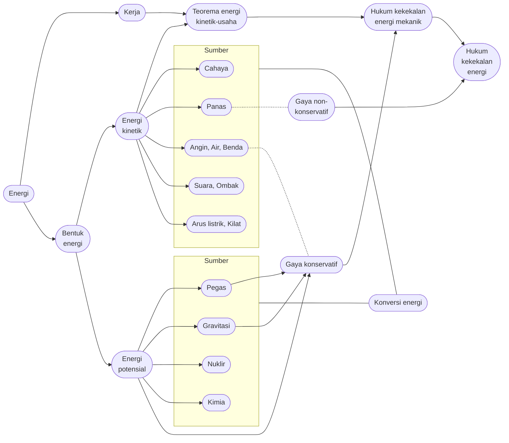

# energy-concept

```mermaid
flowchart LR
  %% links
  E --> W
  E --> EF --> KE & PE
  W --> WKET
  KE --> WKET
  WKET & CF --> LCME
  PE --> SE & GE & NE & CE
  SE & GE --> CF
  PE --> CF
  KE --> RE & TE & ME & WE & EE
  ME -.- CF
  TE -.- NCF
  KEF & PEF ---- EC
  NCF & LCME --> LCE
  %% boxes
  subgraph PEF [Sumber]
    SE([ Pegas ])
    GE([ Gravitasi ])
    NE([ Nuklir ])
    CE([ Kimia ])
  end
  subgraph KEF [Sumber]
    RE([ Cahaya ])
    TE([ Panas ])
    ME([ Angin, Air, Benda ])
    WE([ Suara, Ombak ])
    EE([ Arus listrik, Kilat ])
  end
  E([ Energi ])
  EF([ Bentuk<br>energi ])
  KE([ Energi<br>kinetik ])
  PE([ Energi<br>potensial])
  W([ Kerja ])
  WKET([ Teorema energi<br>kinetik-usaha ])
  CF([ Gaya konservatif ])
  LCME([ Hukum kekekalan<br>energi mekanik ])
  EC([ Konversi energi ])
  NCF([ Gaya non-<br>konservatif])
  LCE([ Hukum<br>kekekalan<br>energi ])
```
