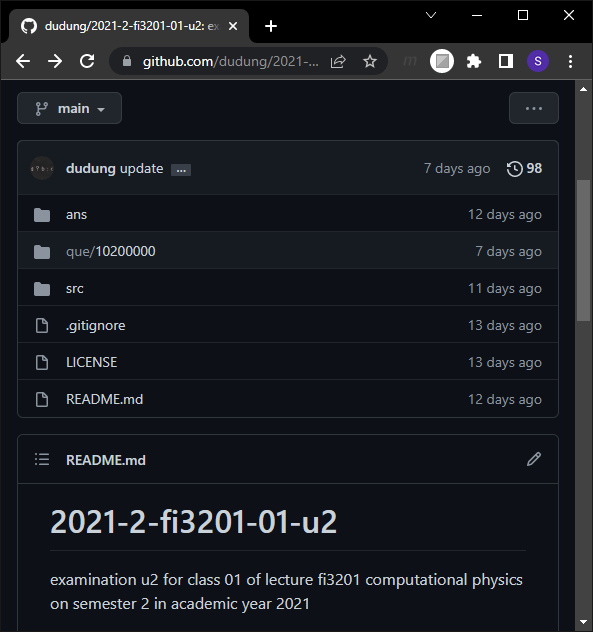
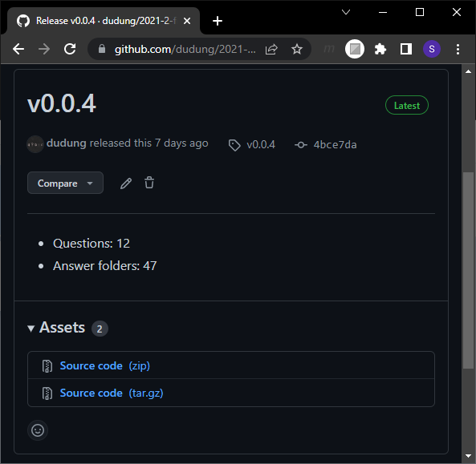
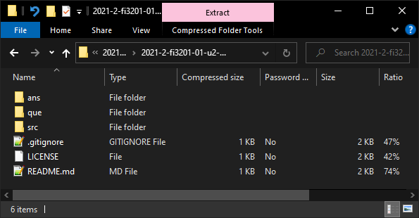
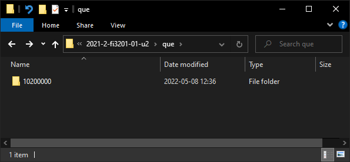
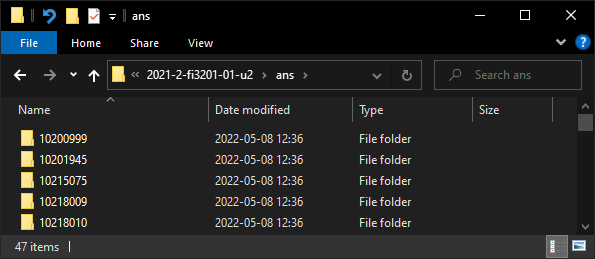
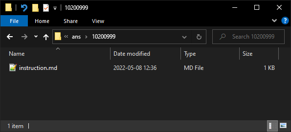

# preparing working folder
Menyiapkan folder kerja

## steps
1. Kunjungi laman [2021-2-fi3201-01-u2](https://github.com/dudung/2021-2-fi3201-01-u2).

  

2. Lihat bagian rilis [v0.0.4](https://github.com/dudung/2021-2-fi3201-01-u2/releases/tag/v0.0.4).

  

3. Unduh [Source code (zip)](https://github.com/dudung/2021-2-fi3201-01-u2/archive/refs/tags/v0.0.4.zip).

  

4. Temukan pada folder Download.

  

5. Lihat isinya dengan membukanya.

  

6. Buat folder baru dan kosong, misalya `2021-2-fi3201-01-u2`.

   

7. Salin semua berkas yang tersimpan dalam `2021-2-fi3201-01-u2-0.0.4.zip` ke folder baru sebelumnya.

  

8. Masuk ke folder `que`.

  

9. Lanjutkan masuk ke folder `10200000` yang berisikan pertanyaan-pertanyaan.

  

10. Salin semua berkas pada folder `10200000`.

11. Mundur ke dua folder sebelumnya dan masuk ke folder `ans`.

  

12. Pilih folder sesuai dengan NIM Anda, untuk contoh ini digunakan `10200999`.

  

13. Tempel semua berkas dari folder `que/10200000` sebelumnya ke folder `ans/10200999` ini.

  

14. Folder pertanyaan dan isinya telah siap.
