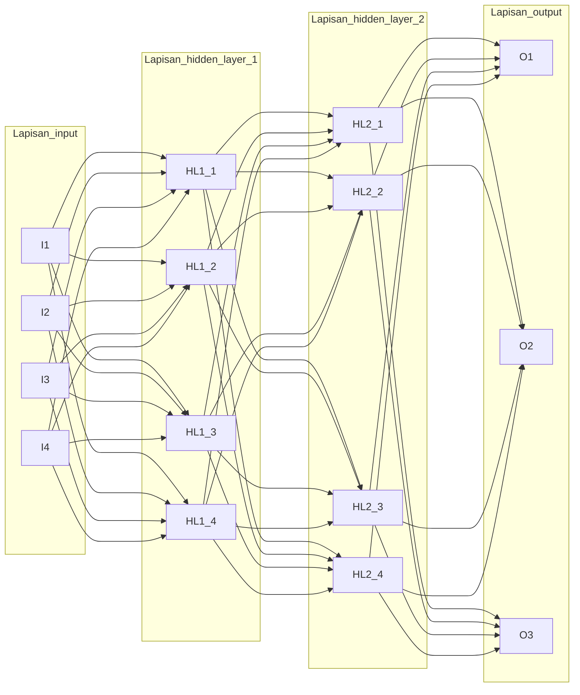

```mermaid
flowchart LR;
    subgraph Lapisan_input;
    I1;
    I2;
    I3;
    I4;
    end;
    subgraph Lapisan_hidden_layer_1;
    HL1_1;
    HL1_2;
    HL1_3;
    HL1_4;
    end;
    subgraph Lapisan_hidden_layer_2;
    HL2_1;
    HL2_2;
    HL2_3;
    HL2_4;
    end;
    subgraph Lapisan_output;
    O1;
    O2;
    O3;
    end;
    
    I1 ---> HL1_1;
    I1 ---> HL1_2;
    I1 ---> HL1_3;
    I1 ---> HL1_4;
    I2 ---> HL1_1;
    I2 ---> HL1_2;
    I2 ---> HL1_3;
    I2 ---> HL1_4;
    I3 ---> HL1_1;
    I3 ---> HL1_2;
    I3 ---> HL1_3;
    I3 ---> HL1_4;
    I4 ---> HL1_1;
    I4 ---> HL1_2;
    I4 ---> HL1_3;
    I4 ---> HL1_4;
    HL1_1 ---> HL2_1;
    HL1_1 ---> HL2_2;
    HL1_1 ---> HL2_3;
    HL1_1 ---> HL2_4;
    HL1_2 ---> HL2_1;
    HL1_2 ---> HL2_2;
    HL1_2 ---> HL2_3;
    HL1_2 ---> HL2_4;
    HL1_3 ---> HL2_1;
    HL1_3 ---> HL2_2;
    HL1_3 ---> HL2_3;
    HL1_3 ---> HL2_4;
    HL1_4 ---> HL2_1;
    HL1_4 ---> HL2_2;
    HL1_4 ---> HL2_3;
    HL1_4 ---> HL2_4;
    HL2_1 ---> O1;
    HL2_1 ---> O2;
    HL2_1 ---> O3;
    HL2_2 ---> O1;
    HL2_2 ---> O2;
    HL2_2 ---> O3;
    HL2_3 ---> O1;
    HL2_3 ---> O2;
    HL2_3 ---> O3;
    HL2_4 ---> O1;
    HL2_4 ---> O2;
    HL2_4 ---> O3;
```
