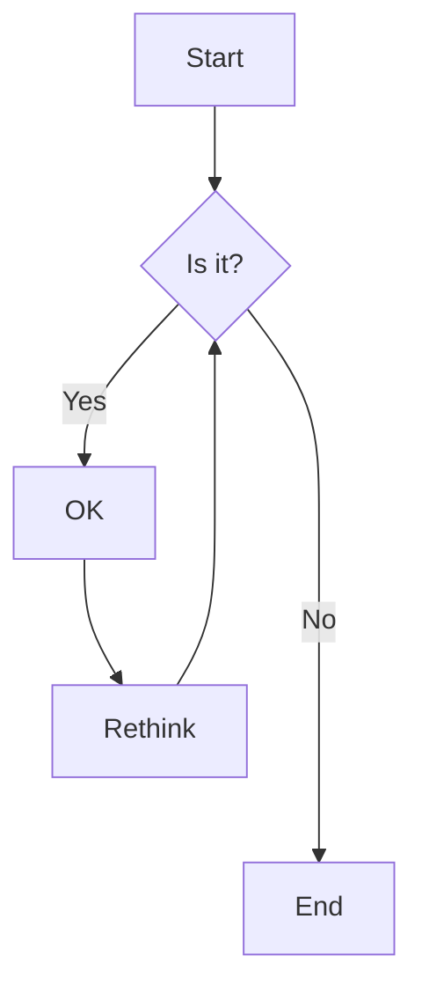

```
%%mermaid_magic -h 800

flowchart TD
    B([ Mulai ]);
    E([ Selesai ]);
    I[/ x, y /];
    D1{ x > y };
    D2{ x = y };
    R1[s = 'x > y'];
    R2[s = 'x < y'];
    R3[s = 'x = y'];
    O[/ s /];
    B --> I;
    I --> D1;
    D1 -- T --> D2;
    D1 -- Y --> R1;
    D2 -- Y --> R3;
    D2 -- T --> R2;
    R1 --> O;
    R2 --> O;
    R3 --> O;
    O --> E;
```
