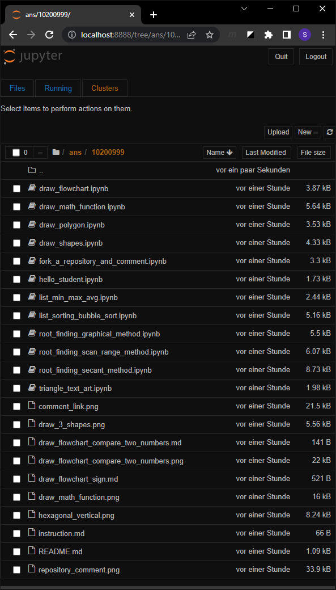
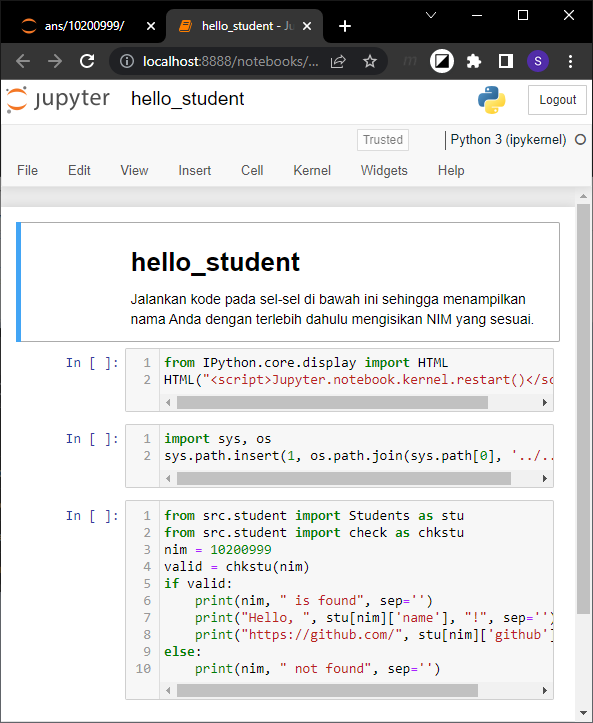
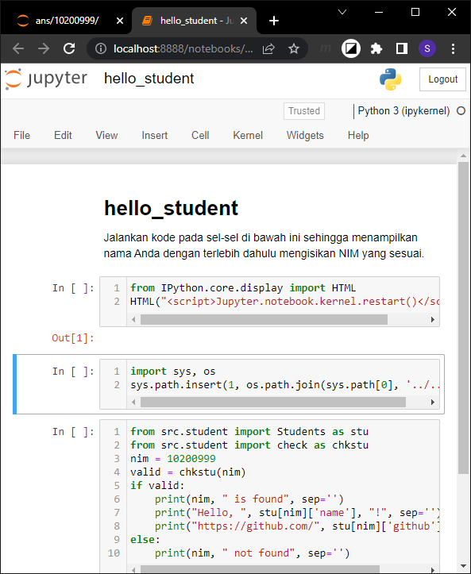
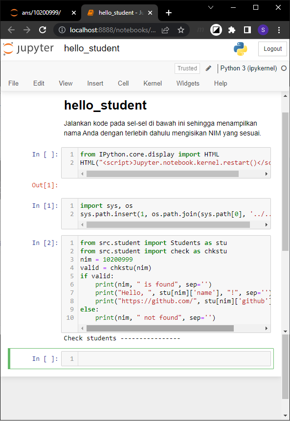
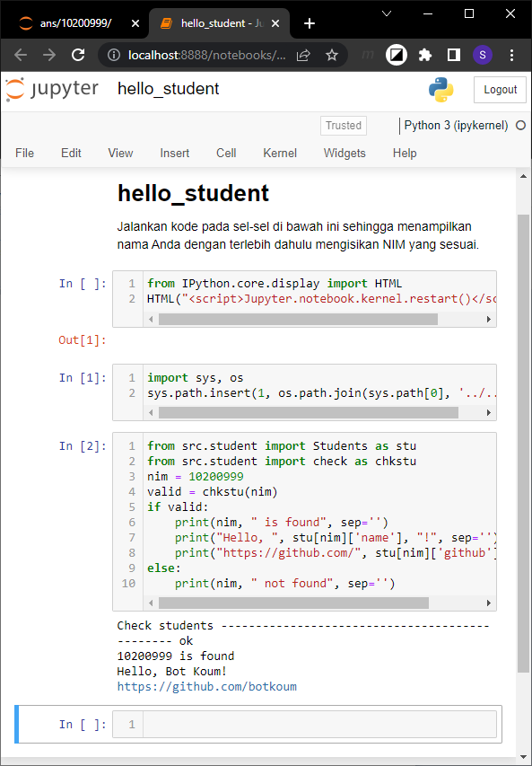

# answering questions
Menjawab pertanyaan

## steps
1. Buka Windows PowerShell atau `cmd`.

  

2. Jalankan Jupyter Notebook dengan mengetikkan `jupyter notebook`.

  
  
3. Pindah ke jendela Jupyter server.

  

4. Navigasi ke folder `ans`.

  

5. Lanjutkan ke folder NIM Anda, e.g. `10200999`.

  

6. Pilih `hello_student.ipynb` dan jalankan dengan melakukan klik tetikus padanya.

  

7. Setelah berkas `hello_student.ipynb` dijalankan ikonnya akan menjadi berwarna hijau dan terbuka tab baru di sebelah tab sebelumnya.

  

8. Pindah ke tab baru tersebut (bila tidak secara otomatis terbuka) dan terlihat bahwa sel pertama telah berada pada mode perintah (command mode) dengan garis vertikal berwarna biru di sisi kirinya.

  
  
9. Tekan Shift-Enter untuk mengeksekusi sel pertama dan sel berikutnya akan tersorot.

  

10. Kembali tekan Shift-Enter untuk mengeksekusi sel kedua, terdapat sel keluaran yang kosong (berwarna merah `Out[1]`, dan sel berikutnya akan tersorot.

  

11. Lanjutkan kembali tekan Shift-Enter untuk mengeksekusi sel ketiga, tidak ada sel keluaran, dan sel berikutnya akan tersorot.

  

12. Ganti variabel `nim` dengan nilai yang sesuai, dalam hal ini digunakan `10200999` dan tekan Shift-Enter sehingga proses berjalan.

  

13. Dan setelah selesai akan diperoleh hasilnya pada bagian bawah.

  

14. Jangan lupa untuk mengubah nilai variabel `nim` dan kerjakan pada folder sesuai NIM Anda, yaitu `ans/102YYNNN` dengan NIM Anda adalah `102YYNNN`.

15. Tekan Ctrl+S untuk menyimpan jawaban Anda dan akan terlihat sekilas waktu penyimpanannya, e.g. `Checkpoint created 13:59:38` pada bagian di atas menu `File` dan lainnya, yang menandakan berkas telah tersimpan.

  
