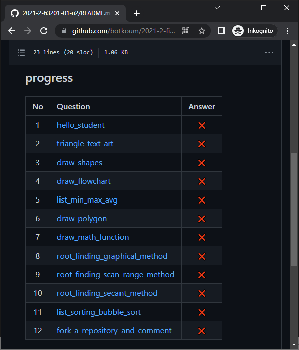
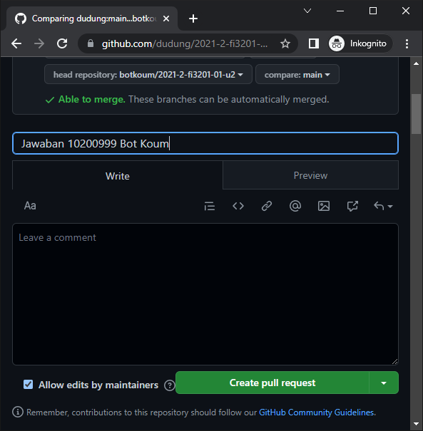

# finalize exam
Memfinalkan hasil ujian

## steps
1. Berkas `README.md` di folder NIM Anda, e.g. `ans/102YYNNN/README.md` yang untuk contoh ini adalah
  
  [ans/10200999/README.md](https://github.com/botkoum/2021-2-fi3201-01-u2/blob/main/ans/10200999/README.md)

2. Dalam berkas `README.md` di folder NIM Anda perbaiki informasi
  [Your Full Name](https://github.com/username) dengan Nama Lengkap Anda dan tautan ke halaman GitHub Anda.
  
  
  
  Untuk contoh di sini adalah
  
  [Bot Koum](https://github.com/botkoum)
  
  yang diperoleh dengan
  
  `[Bot Koum](https://github.com/botkoum)`
 
 3. Yakinkan bahwa Anda telah menjawab semua pertanyaan yang disediakan dengan memastikannya kembali, lalu memberikan tanda :heavy_check_mark: di kolom terkanan setiap baris pada tabel dalam berkas `README.md` di folder NIM Anda, yang bentuk tabelnya adalah seperti di bawah ini.

  
  
  Tanda :heavy_check_mark: diberikan dengan `:heavy_check_mark:`.

4. Setelah yakin bahwa semua pertanyaan telah dijawab, kembali ke halaman depan repositori `2021-2-fi3201-01-u2` yang telah Anda fork dan temukan informasi berikut.

  
  
  Hal ini menggambarkan bahwa cabang (fork) Anda lebih baru (maju, mutakhir) dua perubahan dibandingkan sumbernya, yaitu unggah `hello_student.ipynb` dan `README.md`.

5. Pilih `Contribute` dan tekan `Open pull request`.
  

6. Terdapat kalimat :heavy_check_mark: `Able to merge` yang mengindikasikan bahwa Anda telah mengerjakan di folder NIM Anda sehingga tidak konflik dengan sumber ataupun Rekan Anda.

  
  
  Pilih tombol .

7. Isikan pesan Anda, misalnya `Jawaban 10200999 Bot Koum` yang mengindikasikan maksudnya.

  

  Lanjutkan dengan menekan tombol .
  
8. Hasil pull reques oleh Bot Koum telah tersimpan.

  
  
  Terlihat bahwa ini merupakan pull request pertama (#1).
  
9. Dengan demikian jawaban Anda (dalam hal ini [Bot Koum](https://github.com/botkoum)) telah tersubmit dan terfinalisasi.
