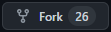
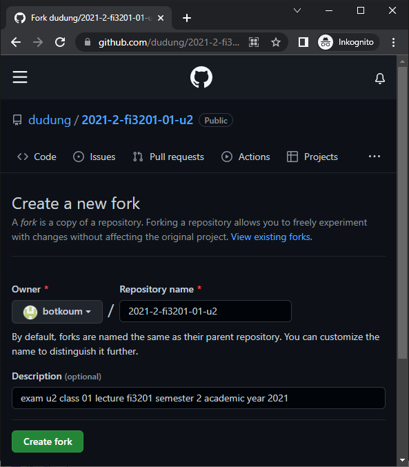
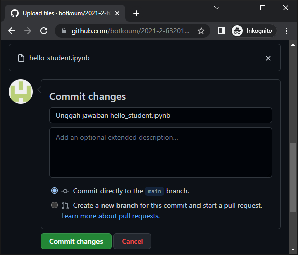
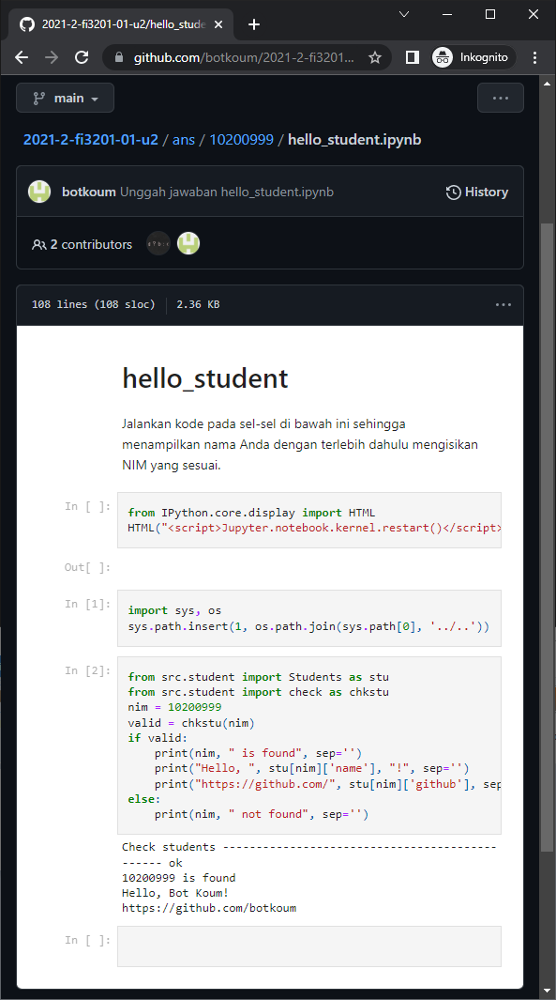

# upload results
Menggunggah jawaban

## steps
1. Navigasi ke folder NIM Anda, yang untuk contoh ini adalah `ans/10200999` dan lihatlah bahwa berkas terakhir yang disunting, sebagai contoh `hello_student.ipynb` terletak teratas dengan tanggal modifikasi `2022-05-08 13:59` sesuai dengan saat penyimpanannya.

  

2. Kunjungi kembali laman [2021-2-fi3201-01-u2](https://github.com/dudung/2021-2-fi3201-01-u2) dan lakukan forking dengan menekan tombol  di bagian atas saat jendela dibuat maksimal, tombol ini sebaris dengan Tombol `Watch` dan `Star`.

  

3. Lakukan [proses fork](https://github.com/dudung/2021-2-fi3201-01-u2/fork) dengan menekan tombol .

  

4. Repository `2021-2-fi3201-01-u2` telah berhasil dibuat fork-nya sebagaimana tersampaikan pada bagian atas `botkoum/2021-2-fi3201-01-u2` dan `forked from dudung/2021-2-fi3201-01-u2`.

 

5. Atau bila sebelumnya telah melakukan fork dapat mengunjungi [daftar forks](https://github.com/dudung/2021-2-fi3201-01-u2/network/members).

  

6. Pilih fork sesuai dengan user Anda, yang dalam hal ini adalah [botkoum](https://github.com/botkoum) sehingga akan menampilkan halaman repositori `2021-2-fi3201-01-u2` yang telah Anda fork.

  

7. Pilih folder sesuai NIM Anda, yang dalam hal ini adalah `10200999` sehingga tampilan `2021-2-fi3201-01-u2/ans/10200999/` baru berisi satu berkas bernama `instruction.md`.

  

8. Tunjuk `...` dan pilih menu 'Upload files'.

  

9. Pilih berkas yang akan diunggah atau seret dan lepaskan pada kotak `Drag files here to add them to your repository`.

  
  
  

10. Lakukan commit, bila perlu tambahkan pesan seperti `Unggah jawaban hello_student.ipynb` lalu tekan tombol .

  

11. Berkas `hello_student.ipynb` telah terunggah pada `2021-2-fi3201-01-u2/ans/10200999/`.

  
  
12. Klik dengan tetikus `hello_student.ipynb` dan hasilnya dapat dilihat.

  

13. Pada halaman depan repositori Anda terlihat berkas terakhir yang diunggah, yang untuk saat ini aalah `hello_student.ipynb`, sekitar lima menit yang lalu dan berada di bahwa folder `ans`.

   

14. Perhatikan pesan yang diberikan pada Langkah 10 dan hasilnya pada Langkah 11-13, di atas daftar folder dan berkas.

15. Ulangi langkah-langkah di atas untuk berkas-berkas lain dalam folder `ans/102YYNNN` dengan `102YYNNN` adalah NIM Anda.
